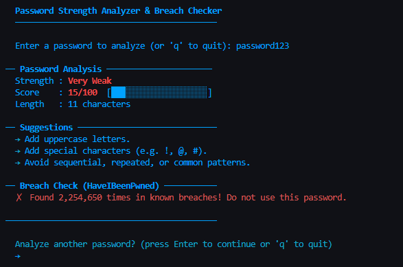
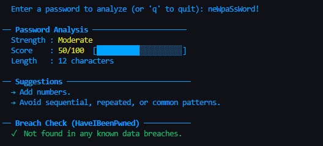
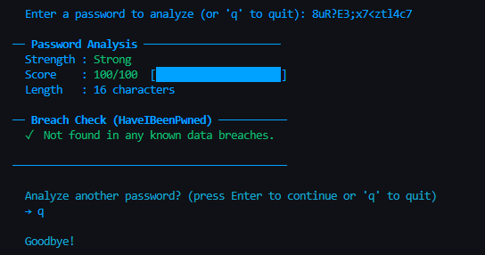

# Password Strength Analyzer & Breach Checker

Python CLI tool that analyzes password strength and verifies whether a password has been exposed in known data breaches — without transmitting the plaintext password.
It uses a combination of rule-based scoring (length, entropy indicators, and pattern detection) and a secure k-anonymity model to query the HaveIBeenPwned database.

---

### Features

- **Strength Scoring** — rates passwords from 0 to 100 based on length, character variety, and pattern detection
- **Actionable Feedback** — tells exactly what to improve
- **Breach Check** — queries the [HaveIBeenPwned](https://haveibeenpwned.com/) database using **k-anonymity**, so the password never leaves the machine
- **Color-coded Output** — instant visual feedback in the terminal
- **Interactive Loop** — analyze multiple passwords in one session

---

### How the Breach Check Works (k-Anonymity)

This tool uses a privacy technique called **k-anonymity** to check passwords against 800 million+ breached passwords safely:

1. The password is hashed locally using SHA-1
2. Only the **first 5 characters** of that hash are sent to the API
3. The API returns ~500 hashes that share that prefix
4. The device checks locally if the full hash is in the list

 (The actual password **never leaves the machine**)

---

### Demo


## Example №1: password123





## Example №2: neWpaSsWord!





## Example №3: 8uR?E3;x7<ztl4c7





---

## Requirements

- Python 3.10 or higher
- Internet connection (for breach check)


## Installation

**1. Clone the repository**
```bash
git clone https://github.com/username/password-checker.git
cd password-checker
```

**2. Install dependencies**
```bash
pip install requests colorama
```

| Package | Purpose |
|---|---|
| `requests` | HTTP calls to the HIBP API |
| `colorama` | Cross-platform terminal colors |

---

## Usage

Run the script:
```bash
python password_checker.py
```

A prompt will appear to enter a password. Type `q` at any prompt to quit.


## Scoring Breakdown

| Criteria | Points |
|---|---|
| Length ≥ 16 characters | +30 |
| Length ≥ 12 characters | +20 |
| Length ≥ 8 characters | +10 |
| Contains lowercase letters | +10 |
| Contains uppercase letters | +10 |
| Contains digits | +10 |
| Contains special characters | +10 |
| All 4 types + length ≥ 12 (bonus) | +30 |
| All 4 types + length ≥ 10 (bonus) | +15 |
| Sequential/repeated/common patterns | −15 |

| Score | Strength |
|---|---|
| 80 – 100 | Strong |
| 50 – 79 | Moderate |
| 25 – 49 | Weak |
| 0 – 24 | Very Weak |


---

### Concepts Covered

This project is a practical introduction to several real-world security and Python concepts:

- **Hashing** with `hashlib` (SHA-1)
- **k-Anonymity** — a privacy-preserving pattern used in production by Firefox Monitor and 1Password
- **REST API calls** with the `requests` library
- **Regex pattern matching** for password analysis
- **CLI design** with interactive input loops
